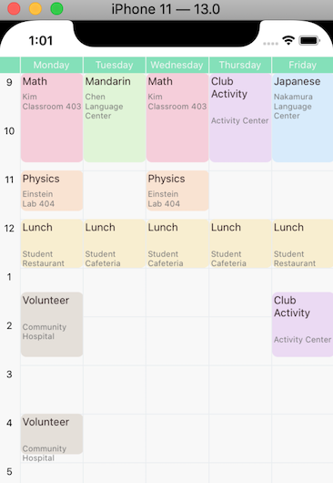

# react-native-timetable

timetable library for React Native



##  HOW TO INSTALL

### Using npm

```sh
npm install react-native-timetable
```
### Using yarn

```sh
yarn add react-native-timetable
```

No need to link just install it.

## TimeTableView Props

 - [scrollViewRef](#scrollViewRef) (Function(`ref`)) function that takes timetableView's ref as parameter
 - [events](#events) (array of [event](#event))
 - numberOfDays (Number) it must be one of 3, 5, 6
 - pivotTime (Number `default: 8`) it tells what time to start timetable view
 - pivotDate (Date, return value of [genTimeBlock](#genTimeBlock))
 - onEventPress (function([`event`](#event)) callBackFunction that triggered when event is pressed
 - [headerStyle](#headerStyle) (object) style for header
 - [locale](#locale) (string) 

### scrollViewRef

Type: Function

function that takes timetableView's ref as parameter

Usage:

```jsx
<TimeTableView 
  scrollViewRef={(ref) => {
    this.timetableRef = ref;
  }}
/>
```

### events

Type: array of [event](#event)

#### event

Type: Object

 - title: String
 - startTime: Date (result of [genTimeBlock](#genTimeBlock))
 - endTime: Date (result of [genTimeBlock](#genTimeBlock))
 - location: String
 - extra_descriptions: Array Of String

e.g.)

```
{
    title: String,
    startTime: Date, // I surely recommend to make Date using genTimeBlock function
    endTime: Date,
    location: String,
    extra_descriptions: Array Of String,
}
```

### headerStyle

Type: object

e.g.)

```
headerStyle: {
  backgroundColor: '#81E1B8'
}
```

### locale

Type: string

TODO: make this works better

## Helper Functions

 - [genTimeBlock](#genTimeBlock)
 - [addLocale](#addLocale)

### genTimeBlock

Type: Function

#### params

 - dayOfWeek (String, One of "SUN", "MON", "TUE", "WED", "THU", "FRI", "SAT")
 - hours (Number, default 0)
 - minutes (Number, default 0)

### addLocale

not yet
