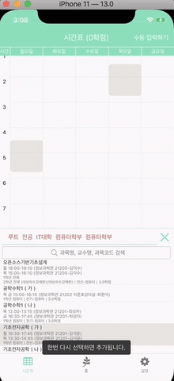

# react-native-timetable

timetable library for React Native




#  INSTALLATION

```sh
npm install react-native-timetable
```

No need to link just install it.

# Example

```jsx
import React, { Component } from 'react';
import {
  SafeAreaView,
  StyleSheet,
  View,
  Alert,
} from 'react-native';
import TimeTableView, { genTimeBlock } from 'react-native-timetable';
const events_data = [
  {
    title: "Math",
    startTime: genTimeBlock("MON", 9),
    endTime: genTimeBlock("MON", 10, 50),
    location: "Classroom 403",
    extra_descriptions: ["Kim", "Lee"],
  },
  {
    title: "Math",
    startTime: genTimeBlock("WED", 9),
    endTime: genTimeBlock("WED", 10, 50),
    location: "Classroom 403",
    extra_descriptions: ["Kim", "Lee"],
  },
  {
    title: "Physics",
    startTime: genTimeBlock("MON", 11),
    endTime: genTimeBlock("MON", 11, 50),
    location: "Lab 404",
    extra_descriptions: ["Einstein"],
  },
  {
    title: "Physics",
    startTime: genTimeBlock("WED", 11),
    endTime: genTimeBlock("WED", 11, 50),
    location: "Lab 404",
    extra_descriptions: ["Einstein"],
  },
  {
    title: "Mandarin",
    startTime: genTimeBlock("TUE", 9),
    endTime: genTimeBlock("TUE", 10, 50),
    location: "Language Center",
    extra_descriptions: ["Chen"],
  },
  {
    title: "Japanese",
    startTime: genTimeBlock("FRI", 9),
    endTime: genTimeBlock("FRI", 10, 50),
    location: "Language Center",
    extra_descriptions: ["Nakamura"],
  },
  {
    title: "Club Activity",
    startTime: genTimeBlock("THU", 9),
    endTime: genTimeBlock("THU", 10, 50),
    location: "Activity Center",
  },
  {
    title: "Club Activity",
    startTime: genTimeBlock("FRI", 13, 30),
    endTime: genTimeBlock("FRI", 14, 50),
    location: "Activity Center",
  },
];

export default class App extends Component {
  constructor(props) {
    super(props);
    this.numOfDays = 5;
    this.pivotDate = genTimeBlock('mon');
  }

  scrollViewRef = (ref) => {
    this.timetableRef = ref;
  };

  onEventPress = (evt) => {
    Alert.alert("onEventPress", JSON.stringify(evt));
  };

  render() {
    return (
      <SafeAreaView style={{flex: 1}}>
        <View style={styles.container}>
          <TimeTableView
            scrollViewRef={this.scrollViewRef}
            events={events_data}
            pivotTime={9}
            pivotDate={this.pivotDate}
            numberOfDays={this.numOfDays}
            onEventPress={this.onEventPress}
            headerStyle={styles.headerStyle}
            formatDateHeader="dddd"
            locale="ko"
          />
        </View>
      </SafeAreaView>
    );
  }
};

const styles = StyleSheet.create({
  headerStyle: {
    backgroundColor: '#81E1B8'
  },
  container: {
    flex: 1,
    backgroundColor: '#F8F8F8',
  },
});
```

# TimeTableView Props

 - [`scrollViewRef`](#scrollViewRef) (Function(`ref`)) function that takes timetableView's ref as parameter
 - [`events`](#events) (array of [`event`](#event))
 - `numberOfDays` (Number) it must be one of `3`, `5`, `6`, `7`
 - `pivotTime` (Number `default: 8`) it tells what time to start timetable view
 - `pivotDate` (Date, return value of [`genTimeBlock`](#genTimeBlock))
 - `onEventPress` (function([`event`](#event)) callBackFunction that triggered when event is pressed
 - [`headerStyle`](#headerStyle) (object) style for header
 - `formatDateHeader` (string default `"dddd"`) dddd -> Monday, ddd -> Mon [checkout more details](https://momentjscom.readthedocs.io/en/latest/moment/04-displaying/01-format/)
 - [`locale`](#locale) (string) country code

## scrollViewRef

Type: Function

function that takes timetableView's ref as parameter

Usage:

```jsx
<TimeTableView 
  scrollViewRef={(ref) => {
    this.timetableRef = ref;
  }}
/>
```

## events

Type: array of [event](#event)

### event

Type: Object

 - title: String
 - startTime: Date (result of [`genTimeBlock`](#genTimeBlock))
 - endTime: Date (result of [`genTimeBlock`](#genTimeBlock))
 - location: String
 - extra_descriptions: Array Of String

e.g.)

```
{
    title: String,
    startTime: Date, // I surely recommend to make Date using genTimeBlock function
    endTime: Date,
    location: String,
    extra_descriptions: Array Of String,
}
```

## headerStyle

Type: object

e.g.)

```
headerStyle: {
  backgroundColor: '#81E1B8'
}
```

## locale

Type: string

| code | language |
| ---- | -------- |
| `en` | English |
| `es` | Spanish |
| `de` | German |
| `fr` | French |
| `ja` | Japanese |
| `ko` | Korean |
| `ms` | Malay |
| `ru` | Russian |
| `zh-cn` | Chinese (China) |
| af | Afrikaans |
| ar-dz | Arabic (Algeria) |
| ar-kw | Arabic (Kuwait) |
| ar-ly | Arabic (Libya) |
| ar-ma | Arabic (Morocco) |
| ar-sa | Arabic (Saudi Arabia) |
| ar-tn | Arabic (Tunisia) |
| ar | Arabic |
| az | Azerbaijani |
| be | Belarusian |
| bg | Bulgarian |
| bm | Bambara |
| bn | Bengali |
| bo | Tibetan |
| br | Breton |
| bs | Bosnian |
| ca | Catalan |
| cs | Czech |
| cv | Chuvash |
| cy | Welsh |
| da | Danish |
| de-at | German (Austria) |
| de-ch | German (Switzerland) |
| dv | Divehi |
| el | Greek |
| en-au | English (Australia) |
| en-ca | English (Canada) |
| en-gb | English (United Kingdom) |
| en-ie | English (Ireland) |
| en-nz | English (New Zealand) |
| eo | Esperanto |
| es-do | Spanish (Dominican Republic) |
| es-us | Spanish (United States) |
| et | Estonian |
| eu | Basque |
| fa | Persian |
| fi | Finnish |
| fo | Faroese |
| fr-ca | French (Canada) |
| fr-ch | French (Switzerland) |
| fy | Western Frisian |
| gd | Scottish Gaelic |
| gl | Galician |
| gom-latn | gom (Latin) |
| gu | Gujarati |
| he | Hebrew |
| hi | Hindi |
| hr | Croatian |
| hu | Hungarian |
| hy-am | Armenian (Armenia) |
| id | Indonesian |
| is | Icelandic |
| it | Italian |
| jv | Javanese |
| ka | Georgian |
| kk | Kazakh |
| km | Khmer |
| kn | Kannada |
| ky | Kirghiz |
| lb | Luxembourgish |
| lo | Lao |
| lt | Lithuanian |
| lv | Latvian |
| me | me |
| mi | Maori |
| mk | Macedonian |
| ml | Malayalam |
| mr | Marathi |
| ms-my | Malay (Malaysia) |
| mt | Maltese |
| my | Burmese |
| nb | Norwegian Bokmål |
| ne | Nepali |
| nl-be | Dutch (Belgium) |
| nl | Dutch |
| nn | Norwegian Nynorsk |
| pa-in | Punjabi (India) |
| pl | Polish |
| pt-br | Portuguese (Brazil) |
| pt | Portuguese |
| ro | Romanian |
| sd | Sindhi |
| se | Northern Sami |
| si | Sinhala |
| sk | Slovak |
| sl | Slovenian |
| sq | Albanian |
| sr-cyrl | Serbian (Cyrillic) |
| sr | Serbian |
| ss | Swati |
| sv | Swedish |
| sw | Swahili |
| ta | Tamil |
| te | Telugu |
| tet | Tetum |
| th | Thai |
| tl-ph | Tagalog (Philippines) |
| tlh | Klingon |
| tr | Turkish |
| tzl | tzl |
| tzm-latn | tzm (Latin) |
| tzm | tzm |
| uk | Ukrainian |
| ur | Urdu |
| uz-latn | Uzbek (Latin) |
| uz | Uzbek |
| vi | Vietnamese |
| x-pseudo | x-pseudo |
| yo | Yoruba |
| zh-hk | Chinese (Hong Kong SAR China) |
| zh-tw | Chinese (Taiwan) |

# Helper Functions

 - [`genTimeBlock`](#genTimeBlock) (function(`String`, `Number`, `Number`)) returns Date

## genTimeBlock

Type: Function

### params

 - dayOfWeek (String, One of `"SUN"`, `"MON"`, `"TUE"`, `"WED"`, `"THU"`, `"FRI"`, `"SAT"`)
 - hours (Number, default `0`)
 - minutes (Number, default `0`)

# Inspirations

https://github.com/hoangnm/react-native-week-view

